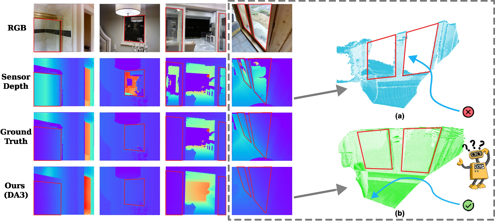

<div align="center">

# Enhancing Glass Surface Reconstruction via Depth Prior for Robot Navigation

### [Project Page](https://jarvisyjw.github.io/GlassRecon/) | [arXiv](https://arxiv.org/abs/2604.18336) | [Code](https://github.com/JMamie/GlassRecon) | [Dataset (Google Drive)](https://drive.google.com/file/d/1u1ODwddeW04bkQ4oda9vgvbKK8MXTQ5N/view?usp=sharing)

[](https://jarvisyjw.github.io/GlassRecon/)

Our method, combined with Depth Anything 3 (DA3), achieves superior performance on glass surface
(red bounding box) depth estimation compared to raw depth sensor measurements, providing accurate
geometry for robot navigation in indoor environments. **(a)** points reconstructed from the sensor
depth — the robot might misperceive the glass as traversable, leading to a collision. **(b)** points
from our estimated depth.

</div>

## Dataset

Dataset with detailed annotated glass depth maps in indoor scenes, organized as follows:

```
GlassRecon/
├── images/                  # RGB images (PNG)
├── intrinsics/              # JSON files with camera intrinsics & depth scale
├── masks/                   # Binary masks for glass regions (PNG)
├── sensor_depths/           # Raw sensor depth maps (PNG)
├── completed_depths/        # Completed depth maps (NPY)
└── evaluation_depths/
    ├── depths_npy/          # Filtered depth maps (NPY) – glass regions that could not be completed are masked out
    ├── depths_vis/          # Visualizations (PNG)
    └── pointclouds/         # 3D point clouds (PLY) - back-projected from depths_npy using intrinsics
```

## Evaluation

The evaluation code (`eval.py`) lives in the [code repository](https://github.com/JMamie/GlassRecon).
It computes metrics (AbsRel, δ < 1.25) between predicted depth maps and ground truth:

```bash
python eval.py --image-folder IMAGE_PATH \
               --pred-folder PREDICTED_DEPTH_PATH \
               --sensor-depth-folder SENSOR_DEPTH_PATH \
               --gt-depth-folder GT_DEPTH_PATH \
               --depth-scale DEPTH_SCALE \
               --outdir OUTPUT_PATH
```

If the predicted depth maps represent inverse depth, add the `--inverse-depth` flag:

```
python eval.py ... --inverse-depth
```

## Citation

If you find our work useful, please cite:

```bibtex
@article{zheng2026enhancing,
  title={Enhancing Glass Surface Reconstruction via Depth Prior for Robot Navigation},
  author={Zheng, Jiamin and Yu, Jingwen and Chen, Guangcheng and Zhang, Hong},
  journal={arXiv preprint arXiv:2604.18336},
  year={2026}
}
```
